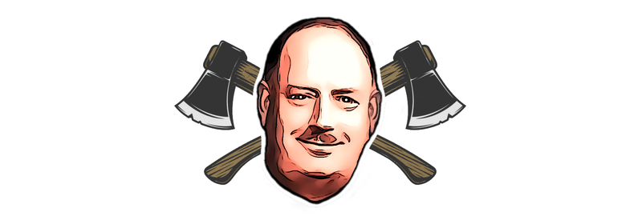

# Beeching - The Azure Axe



Beeching is a command line tool to help you easily delete Azure resources you no longer need. Insprired by [The Beeching Axe](https://blog.nationalarchives.gov.uk/the-beeching-axe/) it allows you to cull vast numbers of resources in a single command. It can delete any resource type based on a name, part of a name, or by tag value.

Resources can be protected from the axe by specifying an exclusion list. This allows you to keep resources that are still in use. The resource list can be further filtered by resource type to only delete certain types of resource, and by resource group to only delete resources in a specific group.

It is written in C# and makes direct the calls to the Azure Management API. It is a .NET Core 6.0 / 7.0 application and can be run on Windows, Linux and Mac.

## Installation

You can install this tool globally, using the dotnet tool command:

```bash
dotnet tool install --global beeching 
```

When a new version is available, you can use the `dotnet tool update` command to upgrade your installation:

```bash
dotnet tool update --global beeching 
```

## Usage

You can invoke the tool using the `beeching` command and by specifying your parameters. The most basic usage is to specify the name of the resources you want to axe. This will use your active Azure CLI subscription and will delete all resources that match the name.

```bash
beeching axe --name my-resource-name
```

You can optionally provide a subscription id, but if you do not specify a subscription, it will use the actively selected subscription from the Azure CLI. 

You can use the `--help` parameter to get a list of all available options.

```bash
beeching --help
```

Which will show:

```
USAGE:
    beeching [OPTIONS]

OPTIONS:
    -s, --subscription    The subscription id to use
    -n, --name            The name (or partial name) of the resources to axe
    -t, --tag             The tag value of the resources to axe
    -r, --resource-types  The types of the resources to axe
    -g, --resource-group  The resource group of the resources to axe
    -e, --exclude         The name of the resources to exclude from the axe
    -f, --force           Force the axe to delete the resources
    -y, --yes             Skip the confirmation prompt
    -q, --quiet           Do not show any output
    -w, --what-if         Show which resources would face the axe
    -h, --help            Prints help information
    -d, --debug           Increase logging verbosity to show all debug logs

COMMANDS:
    axe    The mighty axe that culls the resources
```

> If the application is not working properly, you can use the `--debug` parameter to increase the logging verbosity and see more details.

## Authentication

To make the call to `beeching`, you do need to run this from a user account with permissions to delete the specified resources. Authentication is performed using the `ChainedTokenCredential` provider which will look for the `az cli` token first. Make sure to run `az login` (with optionally the `--tenant` parameter) to make sure you have an active session and have the correct subscription selected by using the `az account set` command.
